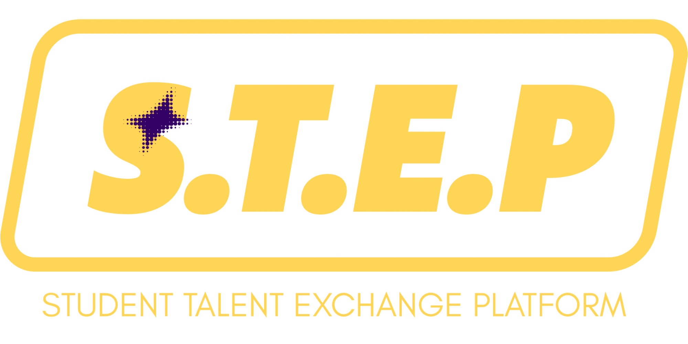

# UiTM STEP (Student Talent Exchange Platform)

> **Unifying the UiTM Ecosystem through a High-Trust, Academic-Elite Marketplace.**

[](https://www.php.net/)
[](https://www.mysql.com/)
[](https://www.digitalocean.com/)

---

## The Vision

UiTM STEP is a centralized, "Fiverr-style" marketplace exclusively for the **34 campuses** of Universiti Teknologi MARA. By leveraging a high-trust digital economy, the platform eliminates "Campus Isolation," allowing students to exchange academic, creative, and technical services regardless of geographical location.

### Core Pillars
- **Verified Trust:** Mandatory `@student.uitm.edu.my` authentication.
- **National Reach:** Toggle between local campus proximity and nationwide digital tasking.
- **Trust-Based Transactions:** Manual payment verification for secure student-to-student settlements.

---

## Key Features

### Dynamic Marketplace
- **Intelligent Filtering:** Toggle between "My Campus" and "All Campuses."
- **Niche Categories:** Specifically curated for student needs (Design, Programming, Tutoring, Delivery).
- **Responsive Grid:** Optimized for mobile and desktop browsing.

### Real-Time Messaging
- **SSE-Powered Chat:** Low-latency communication using Server-Sent Events (SSE).
- **Contextual Orders:** Message sellers directly from gig listings.

### Secure Transaction Workflow
- **Verified Payments:** Buyers upload bank transfer or DuitNow proofs for verification.
- **Lifecycle Management:** Gigs move from *Active* → *Delivered* → *Completed* with verified status tracking.
- **Admin Oversight:** Centralized moderation dashboard for conflict resolution.

---

## Tech Stack & Infrastructure

| Component | Technology | Role |
| :--- | :--- | :--- |
| **Backend** | PHP 8.x (PDO) | Core Logic & API |
| **Frontend** | HTML5, CSS3, Vanilla JS | UI/UX & Interactions |
| **Styling** | Tailwind CSS (CDN) | Modern, Responsive Design |
| **Database** | MySQL 8.0 | Structured Data Persistence |
| **Storage** | DigitalOcean Spaces | S3-Compatible Persistent Storage |
| **Hosting** | DigitalOcean Droplet | Ubuntu/LAMP Stack Environment |

---

## Project Structure

```text
├── api/                # SSE Streamers & AJAX Endpoints
├── assets/
│   ├── css/            # Premium "Academic-Elite" Styling
│   ├── img/            # Static Assets & Category Icons
│   └── js/             # Real-time polling & UI logic
├── db/
│   ├── schema.sql      # Core table structures
│   └── seed.sql        # Demo students, gigs, and admins
├── includes/           # DB Drivers, S3 Logic, & Helpers
├── uploads/            # Local high-performance cache
└── *.php               # Core View Controllers (Marketplace, Profile, etc.)
```

---

## Installation & Setup

### Local Environment
1. **Prerequisites:** Install XAMPP with PHP 8.0+.
2. **Database:**
   - Create database `uitm_step`.
   - Import `db/schema.sql` then `db/seed.sql`.
3. **Config:** Update `includes/db.php` with your local credentials.
4. **Access:** Navigate to `http://localhost/STEP`.

### Production Deployment
1. **Infrastructure:** Provision a DigitalOcean Droplet (Ubuntu 22.04+).
2. **Secrets:** Use `.env` for:
   - `DB_PASS`, `GOOGLE_CLIENT_ID`.
3. **Storage:** Configure S3 credentials in `includes/storage.php`.
4. **SSL:** Ensure `certbot` is configured for HTTPS.

---

## Security Protocol

- **Universal PDO:** 100% protection against SQL Injection via prepared statements.
- **XSS Mitigation:** Comprehensive HTML escaping for all user-generated content.
- **OAuth 2.0:** Secure Google Authentication with domain-level filtering.
- **File Integrity:** MIME-type validation and restricted execution permissions on `/uploads`.

---

## Google Sign-In Behavior
- **Account Linking:** Matches existing student emails.
- **Registration Deferral:** New users are created instantly; campus selection is handled post-login via `complete_registration.php`.
- **Domain Restricted:** Only `@student.uitm.edu.my` and approved subdomains allowed.

---

<div align="center">
  <p><i>Developed as part of the <b>CSC264 and ISP250 group project</b> for <b>StepUp!</b>.</i></p>
  
</div>
